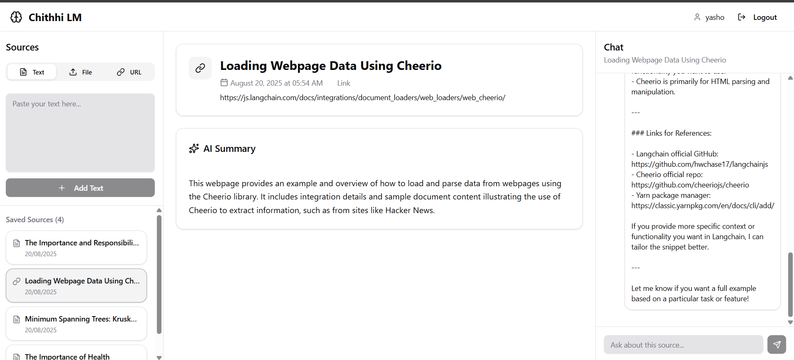

# 📓 Chithhi LM – NotebookLM Clone  

🚀 Live Demo: [notebook-lm-clone-one.vercel.app](https://notebook-lm-clone-one.vercel.app/)  

Chithhi LM is an AI-powered platform that lets you upload, organize, and interact with knowledge sources. It uses **Retrieval-Augmented Generation (RAG)** to let you chat with your documents, web pages, texts and structured data. Built with a modern stack (MERN + LangChain.js + Qdrant + OpenAI), it offers an experience similar to Google’s NotebookLM but fully open-source.  

---

## ✨ Features  

-  **Multi-format Uploads** – Supports **PDF, DOCX, TXT, and CSV** files.  
-  **URL Scraping** – Fetch and process content directly from any webpage.  
-  **Automatic Title & Summary** – Each upload is summarized using AI.  
-  **Chat with Your Data** – Ask questions about your documents/web pages via RAG implementation.  
-  **Authentication** – Secure user access with JWT & bcrypt.  
-  **File Handling** – Handled using Multer, PDF Parser, and Docx/CSV parsing libraries.  
-  **AI-Powered** – Uses **LangChain.js, OpenAI SDK**, and **Qdrant Vector DB** for embeddings & retrieval.  

---

## 🛠️ Tech Stack  

**Frontend:**  
- React (Vite)  
- CSS / Tailwind  
- Zustand for state management 
- ShadCN for components

**Backend:**  
- Node.js + Express  
- MongoDB + Mongoose (Authentication, User Data)  
- Qdrant Vector Database (Embeddings storage)  

**AI / ML & Utilities:**  
- LangChain.js (`@langchain/core`, `@langchain/openai`, `@langchain/qdrant`, `@langchain/textsplitters`)  
- OpenAI SDK  
- Puppeteer (Website scraping)  
- Cheerio (DOM parsing)  
- Multer (File uploads)  
- pdf-parse & Mammoth (PDF & DOCX parsing)  
- d3-dsv (CSV parsing)  

**Auth & Middleware:**  
- JWT (jsonwebtoken)  
- bcryptjs  
- cookie-parser  
- cors  
- dotenv  

---

## 🚀 Getting Started  

You can use the hosted site directly:  
👉 [notebook-lm-clone-one.vercel.app](https://notebook-lm-clone-one.vercel.app/)  

Or run it locally:  
Clone the repository
``` code 
git clone https://github.com/Yasho321/NotebookLM-Clone.git
cd NotebookLM-Clone

#Setup backend
cd backend
npm install
npm run dev # starts backend on localhost

#Setup frontend
cd ../frontend
npm install
npm run dev # starts frontend (Vite development server)
```

 (use your own env).  

---

## 📖 Usage  

1. Upload **PDF, DOCX, TXT, or CSV files** OR provide a webpage **URL** OR type or past your own **TEXT**.  
2. AI will automatically generate a **title** and **summary** for the uploaded content.  
3. Use the **chat box** to ask any question about your material.  
4. Get accurate, context-aware answers using **RAG (Retrieval-Augmented Generation)**.  

---

## Demo 




## ⚡ Roadmap  (Coming next)

- [ ] Support for multiple models (Claude, Llama, etc.)  
- [ ] Enhanced UI with better document visualization  
- [ ] Multi-user workspace collaboration  
- [ ] Export summaries & answers as reports  

---


## 👨‍💻 Author  

- **Chithhi LM** by [Yasho321](https://github.com/Yasho321)  
